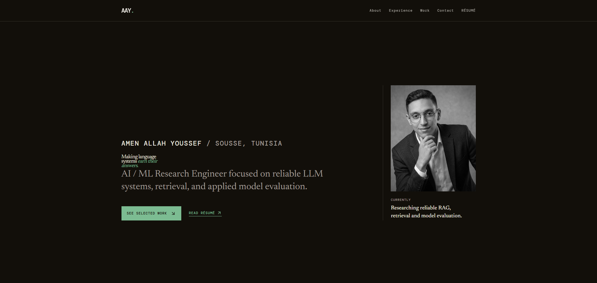

<p align="center">
  
</p>

<h1 align="center">Amen Allah Youssef</h1>

<p align="center">
  <strong>AI / ML Research Engineer</strong><br />
  Building reliable LLM systems, retrieval pipelines, and evaluation-first ML.
</p>

<p align="center">
  <a href="https://www.linkedin.com/in/amen-allah-youssef-8685012bb/"></a>
  <a href="mailto:youssefamenallah.contact@gmail.com"></a>
  <a href="https://portfolio-youssef-amen-allah.vercel.app/"></a>
</p>

<p align="center">
  
</p>

---

<table>
  <tr>
    <td width="66%" valign="top">
      <h2>Making language systems earn their answers.</h2>
      <p>
        I am an AI / ML Research Engineer based in Sousse, Tunisia. I work on language and retrieval systems where choices are backed by evaluation: retrieval strategy, model size, embeddings, and fine-tuning should be measured rather than assumed.
      </p>
      <p>
        My current interests are <strong>reliable RAG</strong>, <strong>hybrid SQL + vector retrieval</strong>, decoder-only transformers, parameter-efficient fine-tuning, and experiment tracking.
      </p>
      <p>
        <a href="https://github.com/Youssefamenallah23?tab=repositories">Browse my repositories →</a>
      </p>
    </td>
    <td width="34%" align="center" valign="top">
      
      <br /><br />
      <sub><strong>Currently exploring</strong><br />Reliable RAG, retrieval, and model evaluation.</sub>
    </td>
  </tr>
</table>

## Selected systems

<table>
  <tr>
    <td width="50%" valign="top">
      <h3>01 — Grade Advisor</h3>
      <p>Hybrid retrieval for Erasteel steel-grade selection. Deterministic SQL filtering handles numeric engineering constraints while vector retrieval handles qualitative intent.</p>
      <p><strong>Python · DuckDB · ChromaDB · Gemini</strong></p>
      <p><a href="https://github.com/Youssefamenallah23/Grade-Advisor">Open repository →</a></p>
    </td>
    <td width="50%" valign="top">
      <h3>02 — Arxiv Research Assistant</h3>
      <p>Evaluation-first RAG over AI research papers, with retrieval, reranking, held-out evaluation, and experiment tracking.</p>
      <p><strong>Python · Qdrant · SentenceTransformers · FastAPI</strong></p>
      <p><a href="https://github.com/Youssefamenallah23/Arxiv-search">Open repository →</a></p>
    </td>
  </tr>
  <tr>
    <td width="50%" valign="top">
      <h3>03 — TacticsGPT</h3>
      <p>A decoder-only transformer for football tactical analysis, developed with custom BPE tokenization, LoRA SFT, and GRPO-style RL fine-tuning.</p>
      <p><strong>Python · PyTorch · JAX · LoRA</strong></p>
      <p><a href="https://github.com/Youssefamenallah23/TacticalGPT">Open repository →</a></p>
    </td>
    <td width="50%" valign="top">
      <h3>04 — Sentinel</h3>
      <p>An event-driven AIOps agent for service monitoring, failure investigation, and semantic caching.</p>
      <p><strong>Python · Docker · FastAPI · Gemini</strong></p>
      <p><a href="https://github.com/Youssefamenallah23/sentinel">Open repository →</a></p>
    </td>
  </tr>
</table>

## Working set

<p>
  
  
  
  
  
  
  
  
</p>

```text
LLM / retrieval     RAG · hybrid retrieval · Qdrant · ChromaDB · AstraDB · reranking
Evaluation          Recall@k · MRR · NDCG · Faithfulness · Precision@k · W&B
Model development   PyTorch · JAX/Flax · Transformers · LoRA · SFT · PPO · GRPO
Engineering         FastAPI · Docker · SQL · PostgreSQL · TypeScript
```

## Beyond the models

- **Freelance Digital Designer & Web Developer, hospitality clients** — Designing digital menus, landing pages, QR-code experiences, and print-ready materials for cafés; Elama Resto Café in M’saken is the lead client.
- **AI Engineer, Novera (2026)** — AI-powered photo matching with InsightFace and PostgreSQL; LLM integration, agentic workflows, and inference optimization.
- **AI Engineering Intern, Mobelite** — Production RAG over 500+ company documents; chunking and embedding experiments evaluated against a precision@5 set.
- **Freelance AI Engineer** — LLM-powered voice automation handling 10,000+ outbound calls per month at 99.5% uptime.

---

<p align="center">
  Open to <strong>internships</strong>, <strong>AI/ML and software-engineering roles</strong>, freelance work, research collaborations, and difficult technical problems worth measuring.<br /><br />
  <a href="mailto:youssefamenallah.contact@gmail.com">Let's talk →</a>
</p>
